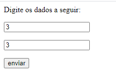
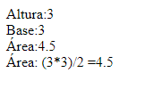

# CalculoBaseDeUmTriangulo
Esse repositório possui a resposta um dos exercícios que me foram requisitados pelo meu professor de PHP da Etec da Zona Leste.  Nesse exercício o programa recebe 2 números (base e a altura de um triângulo) e calcula a área do triângulo.

# Exibido na Web:

